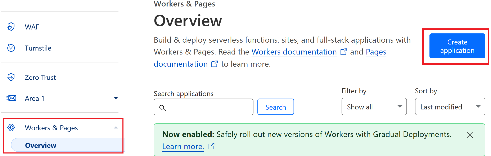
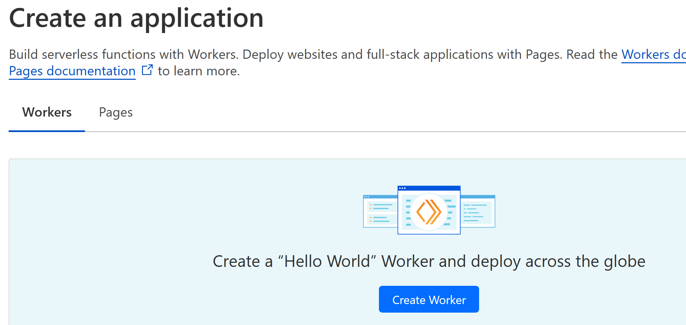
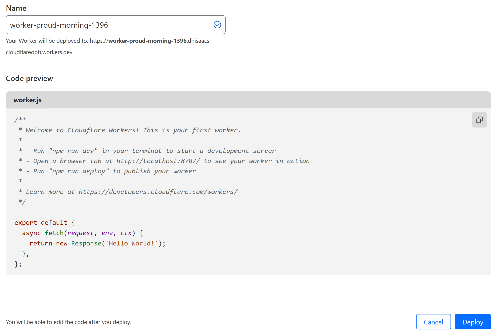
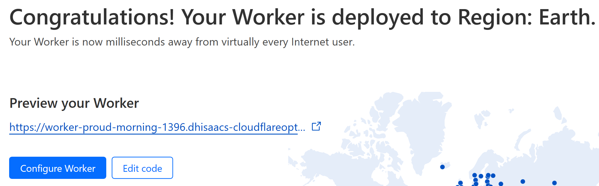
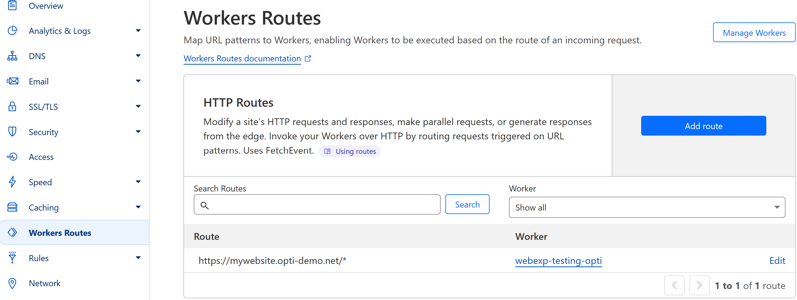

## Table of contents

## Intro

I've been working here for a long time, as a result I get asked for help with a lot of random stuff. Because of that, I end up touching a variety of technologies. (And very occasionally there's even acknowledgement and/or recognition for those types of tasks.)

This time, I was asked to help support some of our experimentation team with their demo process -- mainly, the ability for multiple users to leverage the same website with their own web experimentation javascript snippet.

## Initial implementation

The initial implementation of this was some (very ugly) javascript I added to my site. It would:

1. Check for a specific URL query string, defining the web experimentation project ID
2. If that query string existed, take the project ID value and assign it to a cookie
3. Check if that cookie existed -- if it does, take that project ID and use it to create the link to the experimentation snippet
4. Add the script to load the snippet to the site's <head>.

Result? On a shared website instance, team members could include their experimentation project ID in the URL, and have their own exp snippet loaded on the site. Success! Kinda.

## Moving it to the edge

Kinda? Did the original implementation work? Sure. But it was very slow, and led to flashing because the script was getting loaded so late in the process. The new idea? Add that script at the edge, before the page is loaded.

Most of our demo sites are already leveraging Cloudflare, and they offer a certain number of edge worker calls [even on a free instance](https://developers.cloudflare.com/workers/platform/limits/#worker-limits).

I'd never worked with them before -- could an edge worker be leveraged to improve this process? Turns out yes, and it was pretty straightforward to figure out.

### Create (and customize) a new Worker

So, how did I set this up? I'll walk through what I did for this first Worker -- more experienced users may do things differently, but I think this is a good starting place.

Most importantly: you obviously need a Cloudflare account, with your website traffic passing through it. If you don't have that, this writeup isn't going to be very helpful to you.

First, log in to your Cloudflare account. Then on the left side, in the "Workers & Pages" section, select "Overview":

That will bring you to this screen, where you can create a simple "Hello World" Worker -- we'll use this as a starting point:

Next you'll see the sample "Hello World" code, and a name automatically assigned to your new Worker. You can update the name to align with your project, but we won't edit the code until the next step. For now, just click the "Deploy" button.

That will deploy the Worker, and bring you to a "congratulations" message -- from here, we can go edit that code:

Now you're in Cloudflare's online code editor -- time to update that javascript and make that code do what you want.

**TODO: WRITE UP SIMPLE EXAMPLE OF CODE TO INSERT INTO <HEAD> OF SITE**

### Enable that Worker on a site

Once you're got your Worker set up, you'll want to enable it on a site. In Cloudflare, click in to manage your domain. Then in the left menu, select "Workers Routes".

From there, you can define where that new Worker should run -- your entire website? Just a section? Whatever you want.

## Results

The edge worker was a success, and the experimentation snippet now loads much more quickly, and without flashing. And, I've added a new tool to my toolkit. My advice? If you're thinking about getting started with Cloudflare Edge Workers -- go for it.

## Resources

**TODO: REVIEW + UPDATE LIST**

- https://developers.cloudflare.com/workers/examples/
- https://developers.cloudflare.com/workers/runtime-apis/cache/
- https://developers.cloudflare.com/workers/examples/rewrite-links/
- https://developers.cloudflare.com/workers/examples/extract-cookie-value/
- https://talke.dev/setting-and-reading-cookies-within-cloudflare-workers
