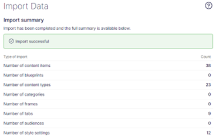
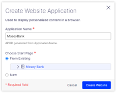

Ready to get started with Optimizely's brand new SaaS CMS? Here's one way to do that.

## Table of contents

## What's the deal?

If you at all monitor the enterprise CMS space, you probably know by now that Optimizely (the place I work, to be clear) has just released our brand new SaaS CMS. (When I say "brand new", I just mean our SaaS offering of the CMS -- it's the same underlying code as our long-existing, industry-leading PaaS CMS.)

There are a lot of helpful articles and blogs about it -- check some of them out on [Optimizely World](https://world.optimizely.com/blogs/). This blog post isn't intended to walk through the benefits of Optimizely's SaaS CMS offering, or the new features (such as the brand new Visual Builder). It's just a quickstart guide to get a new SaaS instance, including test content and website front-end, up and running.

## Prerequisites

The main prereq is a SaaS instance -- it'll also come with an Optimizely Graph instance (our GraphQL API hosted via Cloudflare edge).

For this setup, you also need:

- GitHub account
- Vercel account

## Back-end setup (AKA CMS Setup)

Once you have your instance, the initial setup is similar to: [https://github.com/episerver/cms-saas-vercel-demo/blob/main/docs/cms-config.md](https://github.com/episerver/cms-saas-vercel-demo/blob/main/docs/cms-config.md) (note: as of this writing, that sample site repository is still being updated to handle the new Visual Builder).

1. Import the content pack:
   Download the content file "MoseyBank.episerverdata" [from my SaaS instance here](https://app-ocxcdaism258ip002.cms.optimizely.com/globalassets/export/moseybank.episerverdata)

2. Import the file into the CMS: CMS > Settings > Import

   - Content destination: Root
   - Include all languages

Your results should be similar to mine:

3. Configure an API client for the front-end to use:
   CMS > Settings > API Clients

   - Client ID: _frontend_ [note: you can use anything you want here]
   - Client secret: will be auto-generated
   - Allow the client to impersonate users: TRUE

   Then click “Create”. Be sure to copy and save your Client Secret – you won’t see it again!!

## Front-end -- initial setup

1. Log in to Github
2. Go to the existing repo: [https://github.com/episerver/cms-visual-builder-vercel-beta](https://github.com/episerver/cms-visual-builder-vercel-beta)
3. Fork the repo to your account by clicking the “Fork” button in the top-right
4. Create a new text file on your computer with the properties detailed in the README. A few notes:

   - Several of the values will come from your CMS instance > Dashboard.
   - “OPTIMIZELY_GRAPH_GATEWAY” should be: https://cg.optimizely.com/ (not the beta URL)
   - “OPTIMIZELY_CMS_URL” – URL for your CMS instance, including the “https://” but NOT including a trailing slash
   - “OPTIMIZELY_CMS_CLIENT_ID” and “OPTIMIZELY_CMS_CLIENT_SECRET” are the API client details you created during the backend setup above

   NOTE: this file should NEVER be checked into your Github repository, as it contains private information.

## Set up the front-end with Vercel

1. Log into Vercel
2. Create new project > select Github repository for your fork of the original solution
3. Open the file created in step 4 above in a text editor, select all of the content, and copy it (ctrl-c)
4. In Vercel, expand the “Environment Variables” section – put the cursor in the first box, and hit paste (ctrl-v). This should fill in all of your env variables.
5. Update the SITE_DOMAIN variable for Vercel deploy:
   - SITE_DOMAIN should be “$NEXT_PUBLIC_VERCEL_PROJECT_PRODUCTION_URL” (without the quotes)
6. Click “Deploy”
7. Verify the build is succesful
8. Configure the Application and hostname in the CMS, now that you have a Vercel domain for the project:
   - Go to the project page in Vercel to get the domain –- be sure to use the regular domain, NOT the “Deployment” domain.
   - In the CMS, go to Settings > Applications > Create
     - Application name: MoseyBank
     - Start Page: choose the "Mosey Bank" homepage imported earlier
     - 
   - After creating the application, configure the hostname:
     - Hostname from vercel
     - Locale: "en" (without this, you must include "/en" in your URLs)
9. Run the Graph indexing job: CMS > Settings > Scheduled Jobs > "Optimizely Graph Full Synchronization" -- click "Start"
10. After the job has completed, redeploy the frontend in Vercel.

## So, what now?

Annnnd that should be it -- you should now have a SaaS CMS site up, complete with brand-spanking-new Visual Builder feature in addition to on-page preview and all the other great features you'd expect from Optimizely's CMS.

Not gonna lie, I wrote this up after a few birthday beers (sidenote: a company that doesn't acknowledge 15 years of service probably also won't acknowledge silly things like birthdays), but the instructions should be complete + accurate -- I've run through it with multiple Github and Vercel accounts, and was succesful in each attempt.

That said -- having issues with the setup? Leave a comment here, or reach out to me or the product team and Optimizely OMVPs [on Slack](https://join.slack.com/t/optimizely-community/shared_invite/zt-2d7yzc9fq-ar0alt2yjXxctndBzjUazw).
