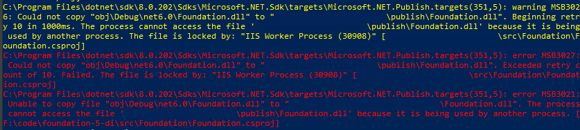

I just want to publish my dotnet code updates locally -- why won't IIS let me do that?

## Table of contents

## What's the issue?

This will be a short one -- I mainly just wanted to document a question that I've been asked multiple times. If you're like me, you might still be running ASP.NET Core sites (in my case, it's often [Foundation](https://github.com/episerver/foundation)) under IIS. You've probably encountered an issue where you made some code changes, and then got an error when you tried to publish:

So, what next?

## How to get past it

Three options I'm aware of (besides switching from IIS to Kestral or Docker) are:

1. Scripting the deployment, and including a step to create an app_offline.htm file before the publish (and then remove it afterwards) -- personally, I use a script pretty similar to the one in this link: https://learn.microsoft.com/en-us/aspnet/core/host-and-deploy/app-offline?view=aspnetcore-8.0#locked-deployment-files

   Note -- if this one's not working for you as-is, one thing to try is increasing the [_shutdownTimeLimit_ config attribute](https://learn.microsoft.com/en-us/aspnet/core/host-and-deploy/iis/web-config?view=aspnetcore-8.0#attributes-of-the-aspnetcore-element).

2. If using WebDeploy, use the "EnableMsDeployAppOffline" setting, which will automatically create and remove the app_offline.htm file mentioned in #1. More details: https://bartwullems.blogspot.com/2021/06/webdeploy-enablemsdeployappoffline.html

3. In .NET 7 and above (and as an experimental feature in .NET 6), there's a new "shadow copy" option for deployments, which "enables the app assemblies to be updated while the app is running by making a copy of the assemblies". I haven't tested this approach yet, but these links should make it pretty clear:

   - Documentation: https://learn.microsoft.com/en-us/aspnet/core/host-and-deploy/iis/advanced?view=aspnetcore-7.0#shadow-copy
   - Blog post with a usage example: https://ryanwilliams.io/blog/locked-files-publishing-net-core-apps-iis-msdeploy
