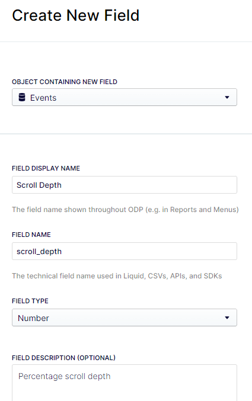
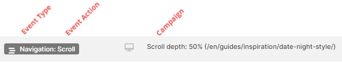
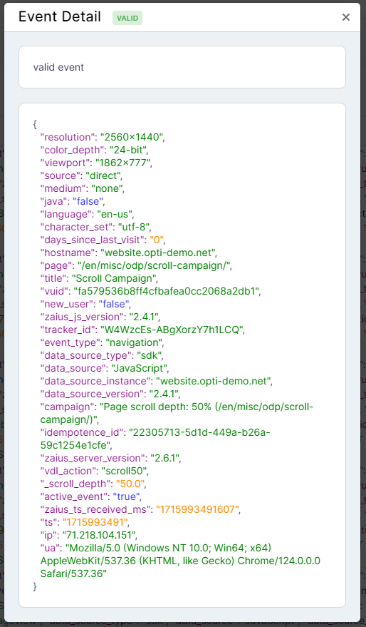
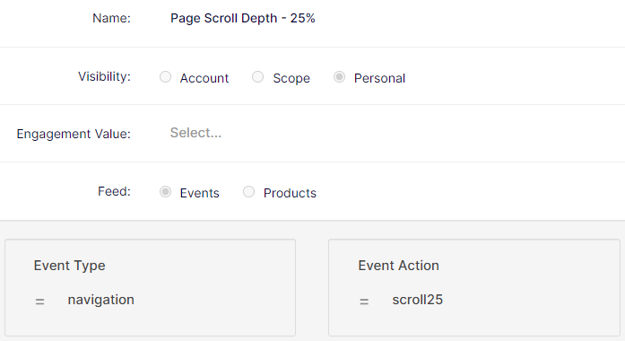

## Table of contents

## Intro

As with my last post, this isn't a "getting started with ODP" -- to get started with ODP, check out the developer docs, ["Implement the ODP JavaScript tag"](https://docs.developers.optimizely.com/optimizely-data-platform/docs/implement-the-odp-javascript-tag), or my past blog posts. They'll provide a solid base on which to build, and allow us to go straight into other tracking examples and how you might use the data in ODP itself.

Today's example? Tracking your website visitor interest in your content, based on how far they scroll down on your pages. This post will walk through the setup required in ODP itself, an example tracking script, and some ways you can leverage the data once the tracking's in place.

## Setup in ODP

The first thing you'll want to do is create a new Event property to track the scroll depth -- is is the only required step. You can do this in ODP > Setup > Objects & Fields. If you want to learn more about creating custom fields, [the documentation is your best resource](https://support.optimizely.com/hc/en-us/articles/4407269395341-Create-custom-fields). Here's the field I'm creating for scroll depth tracking (which align with the script we'll see below) --



## Tracking Script

My full script is below. It's HEAVILY based on the [scroll depth example of custom tracking](https://docs.developers.optimizely.com/web-experimentation/docs/custom-event-tracking#scroll-depth) for [Optimizely's Web Experimentation platform](https://www.optimizely.com/products/experiment/web-experimentation/).

Most of this script is pretty standard javascript -- the key piece I'll focus on for this article are the actual tracking events sent to ODP. First, here's one of the tracking events, triggered when a visitor scrolls 25% down the page:

```js
zaius.event("navigation", {
  action: "scroll",
  scroll_depth: 25,
  campaign: "Scroll depth: 25% (" + pagePath + ")",
});
```

To understand what that's doing, let's break it down a bit. ODP event tracking is based on:

- Event Type
- Event Action
- Additional fields/data

With the ODP snippet in place, the visitor identifier (VUID) is automatically included with the events from the website, along with other attributes such as the current page. You can read [more details about event tracking in the ODP documentation](https://docs.developers.optimizely.com/optimizely-data-platform/docs/thebasics-events).

In this case:

- Event Type == "navigation"
- Event Action == "scroll"
- And it's setting the "scroll_depth" variable (that we created earlier) to "25"

The rest of the call about the campaign is just to define what shows up in the ODP UI for this event. It isn't required, but it makes things look a little nicer when you're browsing a profile:



So, all that said, here's the full script I'm using. Note the commented out lines for logging (_console.log..._) -- when first setting this up and testing on your site, it may help to uncomment those, so you can see in the browser when those scroll events are firing.

```js
/*
 * Usage
 *    This function fires custom events at different scroll depth milestones.
 *    Core script via: https://docs.developers.optimizely.com/web-experimentation/docs/custom-event-tracking#scroll-depth
 */
// Variables to prevent continuous firing of custom events
let hasFiredScroll25Event = false;
let hasFiredScroll50Event = false;
let hasFiredScroll75Event = false;
let hasFiredScroll90Event = false;
let hasFiredScroll100Event = false;

// Function to handle scroll event
function handleScrollEvent() {
  //DOM queries
  const pagePath = window.location.pathname;
  const windowHeight = window.innerHeight;
  const bodyHeight = document.body.scrollHeight;
  // Calculate scroll percentage
  const scrollPercent = (window.scrollY / (bodyHeight - windowHeight)) * 100;
  window.optimizely = window.optimizely || [];
  // Conditional code we'll use to fire events based on scrollPercentage.
  if (scrollPercent >= 25 && !hasFiredScroll25Event) {
    // Push an event to ODP
    zaius.event("navigation", {
      action: "scroll",
      scroll_depth: 25,
      campaign: "Scroll depth: 25% (" + pagePath + ")",
    });
    //console.log("ODP 25% scroll event");
    hasFiredScroll25Event = true;
  }
  if (scrollPercent >= 50 && !hasFiredScroll50Event) {
    // window.optimizely.push({type: "event", eventName: "scroll50"});
    zaius.event("navigation", {
      action: "scroll",
      scroll_depth: 50,
      campaign: "Scroll depth: 50% (" + pagePath + ")",
    });
    //console.log("ODP 50% scroll event");
    hasFiredScroll50Event = true;
  }
  if (scrollPercent >= 75 && !hasFiredScroll75Event) {
    // window.optimizely.push({type: "event", eventName: "scroll75"});
    zaius.event("navigation", {
      action: "scroll",
      scroll_depth: 75,
      campaign: "Scroll depth: 75% (" + pagePath + ")",
    });
    //console.log("ODP 75% scroll event");
    hasFiredScroll75Event = true;
  }
  if (scrollPercent >= 90 && !hasFiredScroll90Event) {
    // window.optimizely.push({type: "event", eventName: "scroll90"});
    zaius.event("navigation", {
      action: "scroll",
      scroll_depth: 90,
      campaign: "Scroll depth: 90% (" + pagePath + ")",
    });
    //console.log("ODP 90% scroll event");
    hasFiredScroll90Event = true;
  }
  if (scrollPercent >= 100 && !hasFiredScroll100Event) {
    // window.optimizely.push({type: "event", eventName: "scroll100"});
    zaius.event("navigation", {
      action: "scroll",
      scroll_depth: 100,
      campaign: "Scroll depth: 100% (" + pagePath + ")",
    });
    //console.log("ODP 100% scroll event");
    hasFiredScroll100Event = true;
  }
}
// Add event listener outside the function
window.addEventListener("scroll", handleScrollEvent);
```

### Validating the script

After adding the script to your site (or just the pages you want to track), you can use ODP's [Event Inspector](https://support.optimizely.com/hc/en-us/articles/4407775345037-Inspect-events) to validate the events are firing as expected.

1. Add script to pages
2. Start Event Inspector (ODP > Account Settings > Event Inspector > Start Inspector)
3. Open website page
4. Scroll down on page
5. Refresh Event Inspector

Result: you should see multiple events in the Inspector -- the initial pageview, and then each subsequent scroll tracking event. For example, here's my 50% scroll event:



## Working With + Activating On Page Scroll Data

### Create Filters

For working with the data -- activating on it via [real-time segments](https://support.optimizely.com/hc/en-us/articles/10033776446733-Build-real-time-segments-in-ODP) or [building custom reports](https://support.optimizely.com/hc/en-us/articles/4407767160717-Use-custom-reports), for two examples -- there's one other step you can take that'll make your life easier: create some filters.

For a full run-down on filters in ODP, [check the documentation](https://support.optimizely.com/hc/en-us/articles/4407766877709-Manage-filters). The filters I've been using for scroll depth tracking are based on the event attributes described above:



I've created separate filters for each level of scroll tracking in the script: 25%, 50%, 75%, 90%, and 100%. You can of course update the script (and filters) to track the specific percentages you're interested in.

Quick tangent: the reason I'm tracking 90% scroll (instead of just skipping to 100%) is because most websites have footers -- we're more interested in how much of an article/landing page someone has seen, not about whether they've scrolled to the absolute bottom of the page. Depending on the size of your site's footer, you may want to play with that number.

**TODO: BEHAVIORS**

_Example of creating a behavior for 'scrolled 50% but not 75%'_

_Need to review how the behavior can be used -- can be applied to a segment, or used in a Campaign -- but how to target the behavior for a specific page?_

_How to best use it? Show modal on exit-intent, if you haven't read >= 90%?_

*https://support.optimizely.com/hc/en-us/articles/4407268765581-Manage-behaviors*

### Create a Report

Here's a sample report to track scroll activities for a page:

**TODO: SCREENSHOT OF REPORT**

The caculated columns are based on:

**TODO: ADD DETAILS ABOUT COLUMNS IN REPORT**

Important note for reading this report: the 25% column represents _everyone_ who scrolled 25%, not just people who stopped there. In other words, the 25% column also includes people who continued to scroll 50%, 75%, etc.

### Create a Real-Time Segment

Ex: Scrolled 25%, but never more than that _\[NOTE: this might not work bc of bugs in ODP RTS + exclusion rules]_

## Conclusion

_write about the benefits + use-cases of page scroll tracking_

_same approach for other types of tracking_

_link back to previous articles, resources -- or have that in separate section?_
