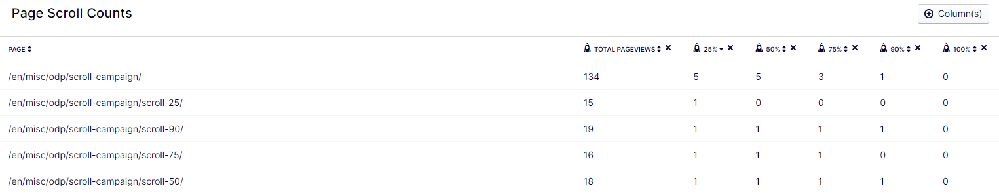
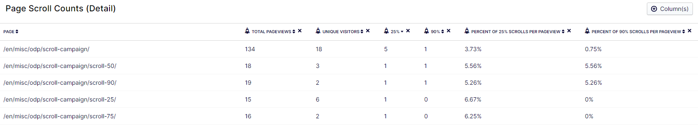
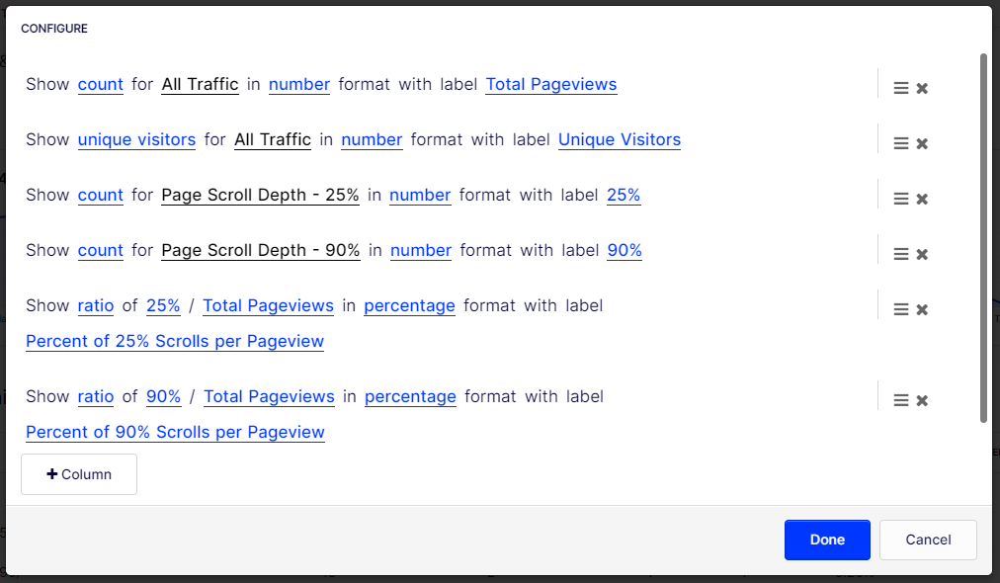
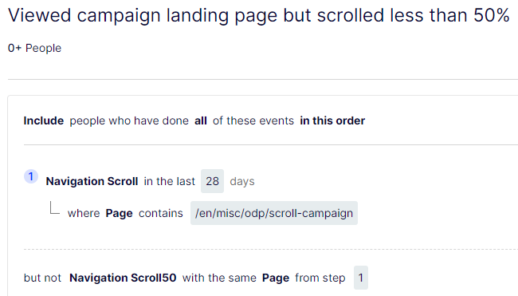

## Table of contents

## Intro

As with my last post, this isn't a "getting started with ODP" -- to get started with ODP, check out the developer docs, ["Implement the ODP JavaScript tag"](https://docs.developers.optimizely.com/optimizely-data-platform/docs/implement-the-odp-javascript-tag), or my past blog posts. They'll provide a solid base on which to build, and allow us to go straight into other tracking examples and how you might use the data in ODP itself.

Today's example? Tracking your website visitor interest in your content, based on how far they scroll down on your pages. This post will walk through the setup required in ODP itself, an example tracking script, and some ways you can leverage the data once the tracking's in place.

## Setup in ODP

The first thing you'll want to do is create a new Event property to track the scroll depth -- is is the only required step. You can do this in ODP > Setup > Objects & Fields. If you want to learn more about creating custom fields, [the documentation is your best resource](https://support.optimizely.com/hc/en-us/articles/4407269395341-Create-custom-fields). Here's the field I'm creating for scroll depth tracking (which align with the script we'll see below) --


## Tracking Script

My full script is below. It's HEAVILY based on the [scroll depth example of custom tracking](https://docs.developers.optimizely.com/web-experimentation/docs/custom-event-tracking#scroll-depth) for [Optimizely's Web Experimentation platform](https://www.optimizely.com/products/experiment/web-experimentation/).

Most of this script is pretty standard javascript -- the key piece I'll focus on for this article are the actual tracking events sent to ODP. First, here's one of the tracking events, triggered when a visitor scrolls 25% down the page:

```js
zaius.event("navigation", {
  action: "scroll25",
  scroll_depth: 25,
  campaign: "Page scroll depth: 25% (" + pagePath + ")",
});
```

To understand what that's doing, let's break it down a bit. ODP event tracking is based on:

- Event Type
- Event Action
- Additional fields/data

With the ODP snippet in place, the visitor identifier (VUID) is automatically included with the events from the website, along with other attributes such as the current page. You can read [more details about event tracking in the ODP documentation](https://docs.developers.optimizely.com/optimizely-data-platform/docs/thebasics-events).

In this case:

- Event Type == "navigation"
- Event Action == "scroll25"
- And it's setting the "scroll_depth" field (that we created earlier) to "25"

The rest of the call about the campaign is just to define what shows up in the ODP UI for this event. It isn't required, but it makes things look a little nicer when you're browsing a profile:


So, all that said, here's the full script I'm using. Note the commented out lines for logging (_console.log..._) -- when first setting this up and testing on your site, it may help to uncomment those, so you can see in the browser when those scroll events are firing.

```js
/*
 * Usage
 *    This function fires custom events at different scroll depth milestones.
 *    Core script via: https://docs.developers.optimizely.com/web-experimentation/docs/custom-event-tracking#scroll-depth
 */
// Variables to prevent continuous firing of custom events
let hasFiredScrollEvent = false;
let hasFiredScroll25Event = false;
let hasFiredScroll50Event = false;
let hasFiredScroll75Event = false;
let hasFiredScroll90Event = false;
let hasFiredScroll100Event = false;

// Function to handle scroll event
function handleScrollEvent() {
  //DOM queries
  const pagePath = window.location.pathname;
  const windowHeight = window.innerHeight;
  const bodyHeight = document.body.scrollHeight;
  // Calculate scroll percentage
  const scrollPercent = (window.scrollY / (bodyHeight - windowHeight)) * 100;
  window.optimizely = window.optimizely || [];
  // Conditional code we'll use to fire events based on scrollPercentage.
  if (!hasFiredScrollEvent) {
    // Push an event to ODP
    zaius.event("navigation", {
      action: "scroll",
      campaign: "Initial page scroll (" + pagePath + ")",
    });
    // console.log("ODP initial scroll event");
    hasFiredScroll25Event = true;
  }
  if (scrollPercent >= 25 && !hasFiredScroll25Event) {
    zaius.event("navigation", {
      action: "scroll25",
      scroll_depth: 25,
      campaign: "Page scroll depth: 25% (" + pagePath + ")",
    });
    // console.log("ODP 25% scroll event");
    hasFiredScroll25Event = true;
  }
  if (scrollPercent >= 50 && !hasFiredScroll50Event) {
    zaius.event("navigation", {
      action: "scroll50",
      scroll_depth: 50,
      campaign: "Page scroll depth: 50% (" + pagePath + ")",
    });
    // console.log("ODP 50% scroll event");
    hasFiredScroll50Event = true;
  }
  if (scrollPercent >= 75 && !hasFiredScroll75Event) {
    zaius.event("navigation", {
      action: "scroll75",
      scroll_depth: 75,
      campaign: "Page scroll depth: 75% (" + pagePath + ")",
    });
    // console.log("ODP 75% scroll event");
    hasFiredScroll75Event = true;
  }
  if (scrollPercent >= 90 && !hasFiredScroll90Event) {
    zaius.event("navigation", {
      action: "scroll90",
      scroll_depth: 90,
      campaign: "Page scroll depth: 90% (" + pagePath + ")",
    });
    // console.log("ODP 90% scroll event");
    hasFiredScroll90Event = true;
  }
  if (scrollPercent >= 100 && !hasFiredScroll100Event) {
    zaius.event("navigation", {
      action: "scroll100",
      scroll_depth: 100,
      campaign: "Page scroll depth: 100% (" + pagePath + ")",
    });
    // console.log("ODP 100% scroll event");
    hasFiredScroll100Event = true;
  }
}
// Add event listener outside the function
window.addEventListener("scroll", handleScrollEvent);
```

Quick tangent: the reason I'm tracking 90% scroll (instead of just skipping to 100%) is because most websites have footers -- we're more interested in how much of an article/landing page someone has seen, not about whether they've scrolled to the absolute bottom of the page. Depending on the size of your site's footer, you may want to tweak that number.

### Validating the script

After adding the script to your site (or just the pages you want to track), you can use ODP's [Event Inspector](https://support.optimizely.com/hc/en-us/articles/4407775345037-Inspect-events) to validate the events are firing as expected.

1. Add script to pages
2. Start Event Inspector (ODP > Account Settings > Event Inspector > Start Inspector)
3. Open website page
4. Scroll down on page
5. Refresh Event Inspector

Result: you should see multiple events in the Inspector -- the initial pageview, and then each subsequent scroll tracking event. For example, here's my 50% scroll event:


## Working With + Activating On Page Scroll Data

So, you've got your data coming in, time to start using it -- activating on it via [real-time segments](https://support.optimizely.com/hc/en-us/articles/10033776446733-Build-real-time-segments-in-ODP) or [building custom reports](https://support.optimizely.com/hc/en-us/articles/4407767160717-Use-custom-reports), for two examples.

### Create Filters

There's a first step you can take that may make your life easier: create some filters. For a full run-down on filters in ODP, [check the documentation](https://support.optimizely.com/hc/en-us/articles/4407766877709-Manage-filters) (or my previous blog post). The filters I've been using for scroll depth tracking are based on the event attributes described above:


I've created separate filters for each level of scroll tracking in the script: 25%, 50%, 75%, 90%, and 100%. You can of course update the script (and filters) to track the specific percentages you're interested in.

### Create a Report

Now you can leverage those filters to create reports, and get some metrics on page scroll rates. First, here's a sample report to show page scroll counts for all pages:



The rocket columns (caculated columns) for this report are built using those filters we set up earlier:


Important note for reading this report: the 25% column represents _everyone_ who scrolled 25%, not just people who stopped there -- if a visitor scrolled 75% of the page, that will add one each to the counts for 25%, 50% and 75%. Or, in other words, the 25% column also includes people who continued to scroll 50%, 75%, etc.

Here's another report example -- this one includes additional metrics, like the percentage of pageviews that scrolled 25% or 90%. Give yourself very quick insights into the success of your pages, and maybe even identify pages you might want to run an A/B test to try to improve performance.



And, here's a screenshot showing how those columns are configured:



### Create a Real-Time Segment

Now, wouldn't it be great to be able to recognize that a visitor on your website only read 25% of an important campaign landing page, and then immediately target them with personalized content or a modal pop-up? You're in luck -- ODP's real-time segments (RTS) can help you do that.

Here's one approach to building an RTS for visitors that have scrolled on the referenced page, but haven't scrolled 50%:



Using this approach, you do have to create a different RTS for each page you want to enable. However, with just a little bit of development work, you could have Optimizely CMS use the ODP API to automatically create an RTS when a new page is published.

## Conclusions

This was just intended to be an example of another type of tracking, and resulting marketing capabilities, that can be enabled via Optimizely's Data Platform.

This is just one step in your quest to understanding your visitors' engagement with your content and identifying shortcomings in the opening content of articles. From there, you can make data-driven decisions, and create segments to target visitors that only read part of the content, and identify places to try an A/B test to improve content performance.

Keep in mind, this should be part of overall content strategy, not simply reviewed on its own. For example, compare the scroll depth data versus bounce rate -- if people are just quickly scrolling then jumping, that doesn't show high engagement. On the flip side, if you have a high conversion rate, low scroll depth rates carry a lot less weight.

But really, this core goal of this blog post is simply to introduce you to another example of custom event tracking to the data platform, and maybe even encourage you to create your own events.

## Resources

Previous post:

- [Optimizely Data Platform (ODP) - Tracking and Usage Examples](/posts/optimizely-data-platform-odp-tracking-and-usage-examples/)

Other references about page scroll tracking:

- https://www.hotjar.com/blog/scroll-tracking/
- https://www.woopra.com/blog/scroll-depth
