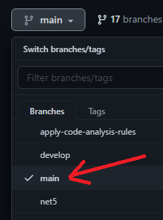
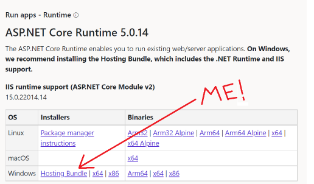
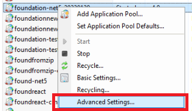
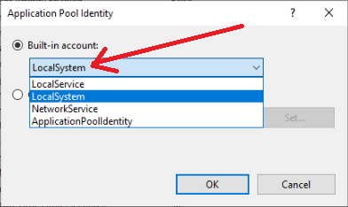

## Table of contents

## What's the goal here?

If you're reading this, you've probably already heard of Foundation, our [Optimizely](https://www.optimizely.com/)  (formerly Episerver) Content Cloud + B2C Commerce Cloud reference site. Want to run a local instance for testing or evaluation purposes? Want to use it as a starter site for a build? No problem – it's freely available up in GitHub: [https://github.com/episerver/Foundation](https://github.com/episerver/Foundation). Below I'm going to walk through a few tips + tricks on getting it running, but first two important callouts:

1.  Use the latest & greatest! This article is focused on the CMS 12 / Commerce 14 version, running on .NET 5. If you want to use the earlier version, you can still follow the setup steps detailed in the readme on the (at the time of this writing) _master_ branch. (But really, that'd be a mistake – .NET 5 is the way to go.)
2.  I'm focused here on the full version of Foundation – there's also a [CMS-only version](https://github.com/episerver/foundation-mvc-cms) if that's more your bag. (I think most of the instructions below should apply to that one, but I make no promises!)

## Getting ready

As noted above, the repository is at: [https://github.com/episerver/Foundation](https://github.com/episerver/Foundation) – for .NET5 (at least at the moment) you'll want to be working with the [_main_ branch](https://github.com/episerver/Foundation/tree/main).



Take a look at the readme to see the system requirements. On Windows, make you'll want SQL Server, Node.JS, and .NET5 runtime. (And some other stuff for running under IIS, but I'll cover that below.) For Mac/Linux (we can run on Mac and Linux now! Exciting!), the setup requires Docker (for SQL Server). You could approach that in other ways, but it's not built in to the setup script.

## Running locally

If you just want to run things locally (for example, for dev or for evaluation purposes), setup is a breeze. Just follow the instructions in the readme for your system type.

The only pro-tip I'd throw in here is to update your _appsettings.json_ file with a valid Optimizely Search & Navigation (AKA Optimizely Find (AKA Episerver Find)) index before running the solution. Don't have an index? Sign up at [https://find.episerver.com](https://find.episerver.com) and generate a free dev index, and then add the index and service URL details:


Then, execute the _dotnet run..._ command, wait until new warnings stop being shown, and then pull up your browser and hit _http://localhost:5000_. (If it doesn't load or you get a "connection refused" message, try again in 30 seconds. The first time up can take a minute or two or three, as it does some initialization steps and content imports.)

To stop the site, press Ctrl-C in your Powershell window (you may need to hit it a few times, if your laptop's like mine).

## Graduating to IIS

Ready to step it up, and run under IIS? It's not all that different, but there are a few gotchas to be aware of.

Note: this is not intended to be an in-depth tutorial on all details of IIS setup. For a deeper dive into creating an IIS site for Optimizely CMS running on .NET 5, a more detailed write-up can be found here: [https://www.jondjones.com/learn-optimizely/cms/how-to-install-optimizely-cms-12-and-configure-a-development-environment/](https://www.jondjones.com/learn-optimizely/cms/how-to-install-optimizely-cms-12-and-configure-a-development-environment/)

### IIS server setup (one-time-only!)

That said: if this is your first time setting up a .NET 5 site in IIS, you must install the .NET 5 IIS module. Download and install the “Hosting Bundle” from: [https://dotnet.microsoft.com/download/dotnet/5.0](https://dotnet.microsoft.com/download/dotnet/5.0)



### Get the code

Download the code from the GitHub repository. (Note: several options to complete this step are presented below, depending on your familiarity with Git. Or you can skip past this step because you already know how to do it. It's your world, I'm just living in it.)

In all cases, I'm assuming the root of the repo is in the folder _\\foundation._

#### Option 1: download the main branch from the repository as a ZIP file

1.  Open the repo in your web browser:
2.  Change to the “_main_” branch
3.  Click the “Code” button, and select “Download ZIP”
4.  After the file has downloaded, right click and select “Properties”. Check the “Unblock” box and click OK.
5.  Unzip the file to a folder

#### Option 2: command line! Clone the repository and then checkout the main branch

1.  Clone the repo:  
    _git clone https://github.com/episerver/foundation.git_
2.  Go into the “foundation” directory where you cloned the repo
3.  Check out the main branch:  
    _git checkout main_

#### Option 3: more command line! Clone + checkout the main branch in one step

1.  Clone and checkout the _main_ branch:  
    _git clone -b main https://github.com/episerver/foundation.git_

### Update appsettings.json

Remember earlier when I wrote about adding a Find (search) index to the _appsettings.json_? Do that. It might save some headaches (search is pretty integral to the Foundation site).

### Have a license?

If you have a license (in the form of a _License.config_ file), copy it to the site directory:  
_\\foundation\\src\\Foundation\\_

Note: a license file isn’t needed for running under localhost. You might be able to sign up for a demo license at [https://license.episerver.com/](https://license.episerver.com/).

### Run the setup

Return to the root folder and run the _setup.cmd_ script as an administrator – this will create and configure the database, and some other initial setup. (Note, the “app name” property will just be used in the database names – it will not create an IIS site during this process.)


### Publish the site

First, create a publish folder -- I created it in the root repository folder (_\\foundation_) and called it “publish”, so it had the following path:

_\\foundation\\publish_

  
Now, open a command line (I like Powershell, myself).

1.  Switch to the site root directory: _c:\\whatever\\your\\path\\is\\foundation_
2.  Publish to the directory you just created (this example assumes the path I used; adjust the path to your publish folder as needed):

    _dotnet publish -c Debug -o .\\publish /p:EnvironmentName=Development_

  
(Once you have your site up and running, subsequent publishes can be tricky – I'm going to include some notes at the bottom of this article around that, but for now this should be all you need.)

### Set up the site in IIS

We're almost there! (Note to self (left publicly to remind me later): maybe this should be scripted and included as an optional step in the setup?) Until then – open up IIS.

1.  Create a new site (right click "Sites" and select "Add Website…")
2.  Site name: foundation-net5 \[you can use anything you want here\]
3.  Physical path: full path to the “publish” folder created in the earlier step
4.  Host name: the url you want to use to access the site.  
      
    Fun tip: if you’re just interested in setting the site up in IIS but don’t need to access it externally --  
      
    If you use the domain "mysite.localmachine.name" (substituting anything for "mysite"), you can set it up locally in IIS without needing to update your hosts file. For example, I used foundation-net5.localmachine.name. (For more info -- [https://www.david-tec.com/2013/07/Never-edit-your-hosts-file-again-when-working-on-localhost/](https://www.david-tec.com/2013/07/Never-edit-your-hosts-file-again-when-working-on-localhost/) -- thanks, David!)

When you created the site, it will have automatically created an app pool. You're going to need to update the Application Pool settings to avoid errors with OpenIDConnect:

Right click the Application Pool created when you created the site in the previous step (by default, it should have the same name as the site), and select “Advanced Settings”



Find the “Identity” setting, and click the dots to open the menu to change the setting


Change the setting to “LocalSystem”, and click OK



### That's it!

You should be all set – open your browser, and try to access the site at the domain you added when setting up the site in IIS.

## Troubleshooting

#### WindowsCryptographicException

Get a “WindowsCryptographicException” when you try to load the site? Double check that you updated the AppPool settings to use LocalSystem identity.

#### Get a syntax error while assets are built?

    \[webpack-cli\] SyntaxError: Invalid regular expression: /(\\p{Uppercase\_Letter}+|\\p{Lowercase\_Letter}|\\d)(\\p{Uppercase\_Letter}+)/: Invalid escape

  
Make sure you're on a recent version of Node.

#### Don't see anything?

Make sure your monitor is on.

## More tips!

### Publishing site changes while running under IIS

After the site is running under IIS, for subsequent publish commands you need to stop the site’s application pool before publishing. Otherwise, the files are locked by the app pool, and it will not deploy correctly.

To avoid this issue, you can manually add a file called “app\_offline.htm” to the publish directory before publishing – this tells IIS to release the files.

To automate this process: create a Powershell script called "_publish.ps1_" and put it in the root _/foundation_ folder. Add the following lines to the file:

```powershell
$pathToApp = '.\publish' 
New-Item -Path $pathToApp -Name "app_offline.htm" -ItemType "file" 
dotnet publish -c Debug -o $pathToApp /p:EnvironmentName=Development 
Remove-Item -Path $pathToApp\app_offline.htm 
```

Adjust the path in the first line as needed, based on your publish folder location. Run this script from Powershell via the command “_.\\publish.ps1_” whenever you want to publish the site, instead of just the standard _dotnet publish_ command we used earlier.

### Changing the port when running under localhost

Want to change the port the site runs on locally? Update the “applicationUrl” setting in the launchSettings.json file (_\\src\\Foundation\\Properties\\launchSettings.json_)

  
For example, to use port 8000, change that line to:

_"applicationUrl": "https://localhost:8001;http://localhost:8000"_

Conclusions
-----------

Hopefully this (much longer than I meant to) post will help you get the .NET 5 version of Foundation up and running locally. Have any questions? Feel free to reach out. Find an issue? Create an issue in the GitHub repo. Wish this article had more fun images? Me too friend, me too.


