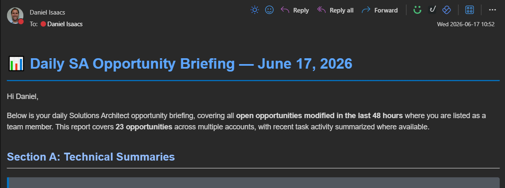
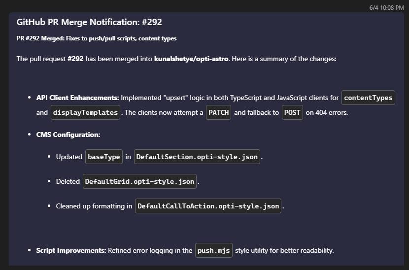

You've probably heard about [Optimizely Opal](https://docs.developers.optimizely.com/platform/opal/overview) by now. And if you've used it, you've probably done the usual stuff: brainstorming, content generation, asking it questions about Optimizely products, etc. All good, all useful.

But that's not what this post is about. I wanted to share a couple of examples of how I've been using Opal to automate things I was already doing manually (or should've been doing more regularly), and how connecting it to external systems like Salesforce and GitHub is actually quite easy.

## Table of contents

## Why these examples?

I'm a Solutions Architect. A lot of my day-to-day involves keeping tabs on customer opportunities and collaborating on shared code. Both of those used to involve a decent amount of manual effort that was... not exactly the best use of my time.

Opal lets you build custom agents and workflows, and it has built-in connectors to systems like Salesforce, GitHub, Microsoft Teams, and more. So I figured: why not let Opal handle the boring parts?

## Example 1: Salesforce opportunity digest

### The problem

We use Salesforce CRM here at Optimizely, and I'm assigned to a bunch of Salesforce opportunities at any given time. Stages change, dates shift, activities get logged -- keeping up with all of that meant logging into Salesforce, clicking around, and reviewing what changed since I last looked (for each Opportunity).

Not hard. And sure, I built out some custom reports in Salesforce to make it easier. But despite that, still tedious, and easy to miss things.

### What I built

I created two things in Opal:

- A **specialized agent** called "SA Opportunity Daily Update Assistant (Email)" that knows how to pull my assigned opportunities from Salesforce and identify any changes from the past two days, and then sends me the summary via email
- A **workflow agent** called "Daily Opportunity Update" that runs on a schedule (every Monday, Wednesday, and Friday mornings) and triggers the specialized agent. This way, I have that opportunity update email sitting in my inbox waiting for me when I start my day.

That's it. Every MWF morning, I get an email in my inbox with a summary of what changed across all my opportunities. Stage updates, date changes, latest activity notes, whatever moved since the last run.

(Yeah, I cropped it to not show the actual opps, sorry! But trust me, it includes a good summary for each updated opportunity.)

### Why it matters

I went from "log into Salesforce and poke around" to "glance at an email three times a week." It catches things I might have missed, and I didn't have to write a single line of integration code. Opal's Salesforce connector handles the data access, and the agent handles the logic.

## Example 2: GitHub PR announcements in Teams

### The problem

I help manage [opti-astro](https://github.com/kunalshetye/opti-astro), an Astro-based frontend for Optimizely SaaS CMS used by a lot of us SAs for demos. Whenever I merged a PR, I'd hop over to Teams and write up a quick summary for the team: what changed, why, anything they should know. It only took a few minutes each time, but it added up. And sometimes I'd forget. Or I'd write a lazy one-liner that didn't really help anyone.

### What I built

Again, two pieces:

- A **specialized agent** called "Process Github Webhook" that takes a GitHub PR payload, reads through the changes, and generates a clear, concise summary of what the PR did
- A **workflow agent** called "Github PR Messenger" that fires whenever a PR is merged on the repo, triggers the specialized agent, and posts the summary to our Teams channel

Now when a PR gets merged, the team gets an automatic summary in Teams within minutes. No manual write-up needed.

(Not the most exciting PR to include. But it was recent.)

### Why it matters

The summaries are maybe better and definitely more consistent than what I was writing manually ~~(not a high bar, admittedly)~~. The team gets timely updates every time, not just when I remembered/made time to post one. And again, no custom integration code: Opal connects to GitHub via webhook and posts to Teams natively.

## The real takeaway

These aren't flashy demos. They're not even particularly complex. But that's kind of the point.

Opal's connectors to external systems like Salesforce, GitHub, and Teams make it surprisingly easy to wire up automations for the kind of small, repetitive tasks that eat into your day. The agent builder lets you define the logic in plain language, and the workflow agents handle the scheduling and triggers.

I've got a few more of these in the works, but I'll save those for a future post.

## More to come

I'm still finding new ways to use Opal beyond the "standard" use cases (and I don't just mean creating a personal skill/context in Opal and having it help me write this blog post -- but yeah, that too). If you've built something interesting with it, I'd love to hear about it. Find me [on LinkedIn](https://www.linkedin.com/in/daniel-isaacs-ab7493160) or in the [Optimizely community Slack](https://join.slack.com/t/optimizely-community/shared_invite/zt-2d7yzc9fq-ar0alt2yjXxctndBzjUazw).
